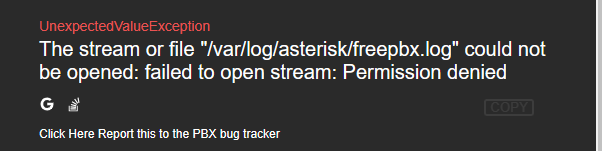
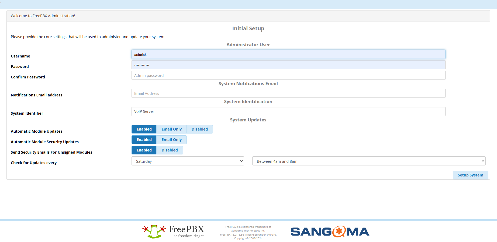

# 参考URL
https://cloudinfrastructureservices.co.uk/how-to-setup-freepbx-using-docker-build-freepbx-docker-container/

## ディレクトリを移動
```
cd app
```

## ネットワークを構築
```
docker network create nginx-proxy
```

## dokcerを起動
```
docker-compose up -d
```

## コンテナのステータス確認
```
docker-compose ps
```

## LOCALHOSTの確認
```
http://localhost/admin/config.php
```

## コンテナの中に入る
```
docker exec -it freepbx-app bash
```

## 設定テスト
```
apachectl configtest
```

初期設定だと'ServerName'の設定がないというエラーになるので、confファイルを修正します。
```
vi /etc/apache2/apache2.conf
```

最後の行に下記を追記します
```
ServerName localhost
```

catコマンドで確認
```
cat /etc/apache2/apache2.conf
```

続いてLOGのディレクトリが不足しているので下記コマンドでLOGディレクトリを追加する

```
mkdir -p /var/log/apache2
chown -R www-data:www-data /var/log/apache2
chmod -R 755 /var/log/apache2
```

もう一度、configtestをする
```
apachectl configtest
```
Syntax OK
になっていれば、apatcheを再起動する
```
service apache2 restart
```

下記ローカル環境でFreePBXが閲覧できるようになっています。
```
http://localhost/admin/config.php
```
※もしなっていなけば、`docker-compose down` でコンテナを停止してから、`docker-compose up`　で再起動してください。

## パーミッション設定


LOGの権限エラーになりますので、各ログの設定をします。

## コンテナの中に入る
```
docker exec -it freepbx-app bash
```

ログディレクトリの権限を確認・修正
/var/log/asterisk ディレクトリの権限を確認します。
```
ls -l /var/log
```
asterisk ユーザーが freepbx.log ファイルおよび /var/log/asterisk ディレクトリへの書き込み権限を持っていない場合は、以下のコマンドで権限を修正します。
```
chown -R asterisk:asterisk /var/log/asterisk
chmod -R 775 /var/log/asterisk
```
ログファイルを手動で作成する（必要に応じて）
freepbx.log ファイルが存在しない場合は、手動で作成して権限を設定します。
```
touch /var/log/asterisk/freepbx.log
chown asterisk:asterisk /var/log/asterisk/freepbx.log
chmod 664 /var/log/asterisk/freepbx.log
```
ApacheとAsteriskサービスの再起動
設定を反映させるために、ApacheとAsteriskを再起動します。
```
service apache2 restart
service asterisk restart
```
## ログイン画面



